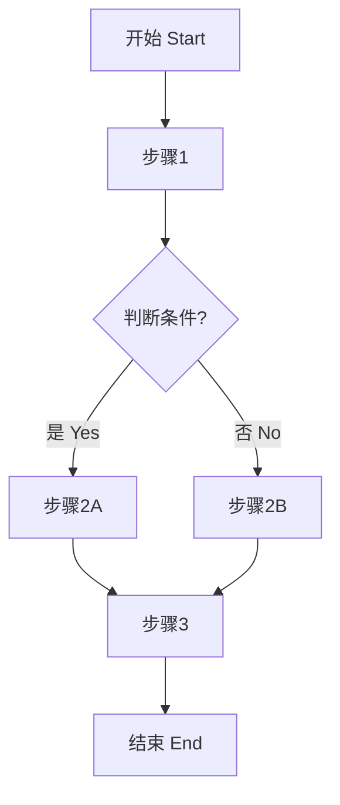

# 功能规格说明书 Functional Specification

## 文档信息 Document Information

| 项目 Item | 内容 Content |
|---------|-------------|
| 文档版本 Document Version | v1.0.0 |
| 创建日期 Created Date | YYYY-MM-DD |
| 最后修改 Last Modified | YYYY-MM-DD |
| 编制作者 Author | |
| 对应PRD版本 PRD Version | |

---

## 修改记录 Change History

| 版本 Version | 日期 Date | 修改人 Modifier | 审核人 Reviewer | 修改内容 Description |
|-------------|---------|---------------|---------------|-------------------|
| v1.0.0 | YYYY-MM-DD | [Name] | | 初始版本 Initial Version |

---

## 目录 Table of Contents

1. [概述 Overview](#1-概述-overview)
2. [功能架构 Function Architecture](#2-功能架构-function-architecture)
3. [功能详细规格 Functional Specifications](#3-功能详细规格-functional-specifications)
4. [用户交互流程 User Interaction Flows](#4-用户交互流程-user-interaction-flows)
5. [界面规范 Interface Specifications](#5-界面规范-interface-specifications)
6. [数据规格 Data Specifications](#6-数据规格-data-specifications)
7. [异常处理 Exception Handling](#7-异常处理-exception-handling)
8. [测试验收标准 Acceptance Criteria](#8-测试验收标准-acceptance-criteria)

---

## 1. 概述 Overview

### 1.1 文档目的 Document Purpose

本文档详细描述产品的功能规格，作为开发团队实现功能的依据，以及测试团队验证功能的参考。

This document details functional specifications as a reference for development and testing.

### 1.2 适用范围 Scope

| 项目 Item | 说明 Description |
|---------|---------------|
| 产品名称 Product Name | |
| 版本范围 Version Scope | v1.0 |
| 模块范围 Module Scope | 所有功能模块 |

### 1.3 术语定义 Terminology

| 术语 Term | 定义 Definition |
|----------|---------------|
| 功能点 Feature Point | 最小的可独立实现和测试的功能单元 |
| 用例 Use Case | 用户完成特定目标的交互序列 |
| | |

---

## 2. 功能架构 Function Architecture

### 2.1 功能模块划分 Module Breakdown

```
┌─────────────────────────────────────────────────────────────┐
│                        产品系统 Product System               │
├─────────────────────────────────────────────────────────────┤
│  ┌───────────┐  ┌───────────┐  ┌───────────┐  ┌───────────┐ │
│  │ 模块A     │  │ 模块B     │  │ 模块C     │  │ 模块D     │ │
│  │ Module A  │  │ Module B  │  │ Module C  │  │ Module D  │ │
│  │           │  │           │  │           │  │           │ │
│  │ ┌───────┐ │  │ ┌───────┐ │  │ ┌───────┐ │  │ ┌───────┐ │ │
│  │ │功能A.1│ │  │ │功能B.1│ │  │ │功能C.1│ │  │ │功能D.1│ │ │
│  │ │功能A.2│ │  │ │功能B.2│ │  │ │功能C.2│ │  │ │功能D.2│ │ │
│  │ │功能A.3│ │  │ │功能B.3│ │  │ │功能C.3│ │  │ │功能D.3│ │ │
│  │ └───────┘ │  │ └───────┘ │  │ └───────┘ │  │ └───────┘ │ │
│  └───────────┘  └───────────┘  └───────────┘  └───────────┘ │
│                                                               │
│  ┌───────────────────────────────────────────────────────┐  │
│  │              公共模块 Common Modules                  │  │
│  │  用户认证 | 权限管理 | 日志记录 | 文件上传 | 消息通知 │  │
│  └───────────────────────────────────────────────────────┘  │
└─────────────────────────────────────────────────────────────┘
```

### 2.2 功能清单 Feature List

| 模块 Module | 功能 ID Feature ID | 功能名称 Feature Name | 优先级 Priority | 复杂度 Complexity |
|-----------|------------------|---------------------|---------------|------------------|
| 模块A Module A | F-A-001 | | P0/P1/P2 | 高/中/低 |
| 模块A Module A | F-A-002 | | P0/P1/P2 | 高/中/低 |
| 模块B Module B | F-B-001 | | P0/P1/P2 | 高/中/低 |
| 模块B Module B | F-B-002 | | P0/P1/P2 | 高/中/低 |

---

## 3. 功能详细规格 Functional Specifications

### 3.1 模块A：[模块名称]

#### F-A-001：[功能名称]

**基本信息 Basic Information:**

| 属性 Attribute | 值 Value |
|-------------|---------|
| 功能 ID Feature ID | F-A-001 |
| 功能名称 Feature Name | |
| 功能描述 Description | |
| 用户角色 User Role | |
| 优先级 Priority | P0 |
| 所属版本 Version | v1.0 |

**用例描述 Use Case Description:**

| 用例要素 Element | 内容 Content |
|--------------|-----------|
| 用例名称 Use Case Name | |
| 参与者 Actor | |
| 前置条件 Precondition | |
| 后置条件 Postcondition | |
| 触发条件 Trigger | |

**基本流程 Basic Flow:**

| 步骤 Step | 操作者 Actor | 操作描述 Action | 系统响应 System Response |
|----------|------------|---------------|----------------------|
| 1 | 用户 | | |
| 2 | 系统 | | |
| 3 | 用户 | | |
| 4 | 系统 | | |

**备选流程 Alternative Flows:**

| 流程 Flow | 条件 Condition | 处理步骤 Steps |
|---------|--------------|--------------|
| Alt-1 | | |
| Alt-2 | | |

**异常流程 Exception Flows:**

| 异常 Exception | 条件 Condition | 处理方式 Handling |
|--------------|--------------|----------------|
| Exc-1 | | |
| Exc-2 | | |

**业务规则 Business Rules:**

| 规则ID Rule ID | 规则描述 Rule Description |
|--------------|----------------------|
| BR-A-001-1 | |
| BR-A-001-2 | |

**数据规格 Data Specification:**

| 数据项 Data Item | 类型 Type | 必填 Required | 验证规则 Validation |
|----------------|---------|------------|------------------|
| | | | |

**界面元素 UI Elements:**

| 元素 ID Element ID | 元素类型 Type | 标签 Label | 说明 Description |
|------------------|-------------|----------|----------------|
| | 按钮/输入框/下拉框/其他 | | |

**验收标准 Acceptance Criteria:**

- [ ] AC-001: [具体验收条件]
- [ ] AC-002: [具体验收条件]
- [ ] AC-003: [具体验收条件]

#### F-A-002：[功能名称]

<!-- 按照相同结构继续 -->

### 3.2 模块B：[模块名称]

#### F-B-001：[功能名称]

<!-- 按照相同结构继续 -->

---

## 4. 用户交互流程 User Interaction Flows

### 4.1 核心交互流程 Core Interaction Flows

#### 流程1：[流程名称]

**流程图 Flowchart:**



**流程描述 Flow Description:**

| 步骤 Step | 页面/屏幕 Page/Screen | 操作 Action | 说明 Notes |
|----------|---------------------|-----------|----------|
| 1 | | | |
| 2 | | | |
| 3 | | | |

#### 流程2：[流程名称]

<!-- 按照相同结构继续 -->

### 4.2 页面跳转关系 Page Navigation Map

```
首页 Home
  ├── 登录页 Login Page
  │     └── 首页 Home
  ├── 注册页 Register Page
  │     ├── 验证码页 Verify Page
  │     └── 首页 Home
  ├── 用户中心 User Center
  │     ├── 个人信息 Profile
  │     ├── 设置 Settings
  │     └── 订单列表 Orders
  └── 产品列表 Product List
        └── 产品详情 Product Detail
              └── 购买页面 Purchase Page
```

---

## 5. 界面规范 Interface Specifications

### 5.1 页面布局规范 Page Layout Specifications

#### 页面1：[页面名称]

**页面信息 Page Information:**

| 属性 Attribute | 值 Value |
|-------------|---------|
| 页面 ID Page ID | P-001 |
| 页面名称 Page Name | |
| 页面类型 Page Type | 列表页/详情页/表单页/其他 |
| 访问权限 Access | |

**布局结构 Layout Structure:**

```
┌────────────────────────────────────────────────────┐
│                   顶部导航栏 Header                  │
├────────────────────────────────────────────────────┤
│  ┌────────┐  ┌────────────────────────────────┐   │
│  │        │  │                                │   │
│  │ 侧边栏  │  │       主要内容区域              │   │
│  │ Sidebar│  │     Main Content Area          │   │
│  │        │  │                                │   │
│  │        │  │                                │   │
│  └────────┘  └────────────────────────────────┘   │
├────────────────────────────────────────────────────┤
│                   底部信息 Footer                    │
└────────────────────────────────────────────────────┘
```

**页面元素清单 Page Elements:**

| 元素ID Element ID | 元素名称 Element Name | 类型 Type | 位置 Position | 属性 Properties |
|-----------------|---------------------|---------|--------------|---------------|
| | | | | |

**交互说明 Interaction:**

| 元素 Element | 事件 Event | 行为 Behavior |
|------------|----------|-------------|
| | 点击/悬停/输入/其他 | |

#### 页面2：[页面名称]

<!-- 按照相同结构继续 -->

### 5.2 组件规范 Component Specifications

| 组件名称 Component | 使用场景 Usage | 状态 States | 属性 Properties | 事件 Events |
|------------------|--------------|-----------|---------------|-----------|
| 按钮 Button | | 正常/禁用/加载/其他 | | |
| 输入框 Input | | 正常/聚焦/错误/其他 | | |
| 下拉选择 Select | | | | |
| 弹窗 Modal | | 打开/关闭 | | |
| 通知 Notification | | 显示/隐藏 | | |

### 5.3 响应式设计 Responsive Design

| 断点 Breakpoint | 屏幕宽度 Screen Width | 布局调整 Layout Change |
|--------------|---------------------|----------------------|
| 移动端 Mobile | < 768px | |
| 平板 Tablet | 768px - 1024px | |
| 桌面 Desktop | > 1024px | |

---

## 6. 数据规格 Data Specifications

### 6.1 数据实体规格 Entity Specifications

#### 实体1：[实体名称]

**实体属性 Entity Attributes:**

| 字段名 Field | 数据类型 Type | 长度 Length | 默认值 Default | 必填 Required | 唯一 Unique | 索引 Index | 说明 Description |
|------------|-------------|----------|-------------|------------|-----------|----------|---------------|
| id | String/Number | - | - | 是 | 是 | 主键 | 主键 |
| | | | | | | | |

**关系 Relationships:**

| 关系类型 Relationship Type | 目标实体 Target Entity | 外键字段 Foreign Key | 级联规则 Cascade |
|----------------------|---------------------|-------------------|---------------|
| 一对多 1:N | | | |
| 多对一 N:1 | | | |

#### 实体2：[实体名称]

<!-- 按照相同结构继续 -->

### 6.2 接口数据规格 API Data Specifications

#### 接口1：[接口名称]

**请求规格 Request Specification:**

| 项目 Item | 值 Value |
|----------|---------|
| 接口路径 Path | |
| 请求方法 Method | GET/POST/PUT/DELETE |
| 内容类型 Content-Type | application/json |

**请求体 Request Body:**

```json
{
  "field1": "value1",
  "field2": "value2"
}
```

| 字段 Field | 类型 Type | 必填 Required | 验证规则 Validation |
|----------|---------|------------|------------------|
| field1 | String | 是 | 长度1-100 |
| field2 | Number | 否 | > 0 |

**响应规格 Response Specification:**

**成功响应 Success Response (200):**

```json
{
  "code": 200,
  "message": "success",
  "data": {
    "id": "123",
    "field1": "value1"
  }
}
```

**错误响应 Error Response:**

```json
{
  "code": 400,
  "message": "参数错误",
  "errors": [
    {
      "field": "field1",
      "message": "不能为空"
    }
  ]
}
```

#### 接口2：[接口名称]

<!-- 按照相同结构继续 -->

### 6.3 数据验证规则 Data Validation Rules

| 字段 Field | 验证类型 Validation Type | 规则 Rule | 错误消息 Error Message |
|----------|----------------------|---------|---------------------|
| | 必填/格式/长度/范围/其他 | | |
| | 必填/格式/长度/范围/其他 | | |

---

## 7. 异常处理 Exception Handling

### 7.1 异常场景分类 Exception Categories

| 异常类型 Exception Type | 处理策略 Handling Strategy |
|----------------------|----------------------|
| 网络异常 Network Error | 提示用户检查网络，提供重试按钮 |
| 服务器异常 Server Error | 显示友好错误页面，记录日志 |
| 参数错误 Parameter Error | 提示具体错误信息，高亮错误字段 |
| 权限异常 Permission Error | 提示权限不足，引导登录或联系管理员 |
| 业务异常 Business Error | 显示业务错误信息，提供解决方案 |

### 7.2 错误代码规范 Error Code Specification

| 错误码 Error Code | HTTP状态码 HTTP Code | 错误类型 Type | 用户消息 User Message |
|-----------------|-------------------|------------|-------------------|
| 1001 | 400 | 参数错误 | 请求参数不正确 |
| 1002 | 401 | 未认证 | 请先登录 |
| 1003 | 403 | 无权限 | 您没有权限执行此操作 |
| 2001 | 404 | 资源不存在 | 请求的资源不存在 |
| 5001 | 500 | 服务器错误 | 服务器处理失败，请稍后重试 |
| 5002 | 503 | 服务不可用 | 服务暂时不可用 |

### 7.3 异常处理流程 Exception Handling Flow

```
异常发生
  ↓
记录日志 Log Error
  ↓
判断异常类型 Check Type
  ↓
├─ 可恢复 Recoverable → 提示用户 + 重试选项
└─ 不可恢复 Unrecoverable → 显示错误页面
```

---

## 8. 测试验收标准 Acceptance Criteria

### 8.1 功能测试标准 Functional Testing Criteria

| 功能 Feature | 测试场景 Test Scenario | 预期结果 Expected Result | 优先级 Priority |
|------------|---------------------|----------------------|---------------|
| | 正常流程 | | P0 |
| | 异常流程 | | P0 |
| | 边界条件 | | P1 |

### 8.2 非功能测试标准 Non-Functional Testing Criteria

| 测试类型 Test Type | 测试项 Test Item | 标准 Standard | 测试方法 Method |
|-----------------|----------------|-------------|---------------|
| 性能测试 Performance | 响应时间 | < 2秒 | 压力测试 |
| 兼容性测试 Compatibility | 浏览器兼容 | Chrome/Safari/Firefox | 兼容性测试 |
| 安全测试 Security | SQL注入防护 | 不存在漏洞 | 安全扫描 |

### 8.3 验收检查清单 Acceptance Checklist

**功能验收 Functional:**

- [ ] 所有P0功能正常工作
- [ ] 所有P1功能正常工作
- [ ] 异常场景正确处理
- [ ] 数据验证正确执行
- [ ] 业务规则正确应用

**界面验收 UI:**

- [ ] 所有页面布局正确
- [ ] 响应式适配正常
- [ ] 交互反馈及时
- [ ] 错误提示清晰

**数据验收 Data:**

- [ ] 数据保存完整
- [ ] 数据读取正确
- [ ] 数据一致性保持
- [ ] 数据安全保护

---

## 附录 Appendix

### 附录A：功能优先级定义 Priority Definition

| 优先级 Priority | 定义 Definition | 示例 Example |
|--------------|--------------|------------|
| P0 | 必须有，否则无法发布 Must Have | 核心业务功能 |
| P1 | 应该有，影响用户体验 Should Have | 重要辅助功能 |
| P2 | 可以有，锦上添花 Could Have | 增强体验功能 |

### 附录B：参考资料 Reference Materials

-
-
-

### 附录C：变更历史 Change History

| 日期 Date | 变更内容 Change | 影响功能 Affected Features |
|----------|---------------|-------------------------|
| | | |

---

## 审批与签署 Approvals

| 角色 Role | 姓名 Name | 签名 Signature | 日期 Date |
|----------|---------|--------------|---------|
| 产品经理 Product Manager | | | |
| 技术负责人 Tech Lead | | | |
| 测试负责人 QA Lead | | | |

---

**文档结束 End of Document**
