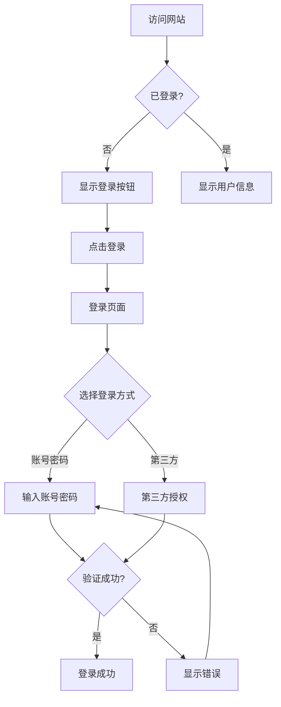

# 原型设计文档 Prototype Design Document

## 文档信息 Document Information

| 项目 Item | 内容 Content |
|---------|-------------|
| 文档版本 Document Version | v1.0.0 |
| 创建日期 Created Date | YYYY-MM-DD |
| 最后修改 Last Modified | YYYY-MM-DD |
| 设计师 Designer | |
| 原型工具 Prototype Tool | □ Figma □ Axure □ Sketch □ 其他 |

---

## 修改记录 Change History

| 版本 Version | 日期 Date | 修改人 Modifier | 审核人 Reviewer | 修改内容 Description |
|-------------|---------|---------------|---------------|-------------------|
| v1.0.0 | YYYY-MM-DD | [Name] | | 初始版本 Initial Version |

---

## 目录 Table of Contents

1. [原型概述 Prototype Overview](#1-原型概述-prototype-overview)
2. [设计原则 Design Principles](#2-设计原则-design-principles)
3. [信息架构 Information Architecture](#3-信息架构-information-architecture)
4. [页面原型设计 Page Prototypes](#4-页面原型设计-page-prototypes)
5. [交互设计规范 Interaction Design](#5-交互设计规范-interaction-design)
6. [视觉设计规范 Visual Design Guidelines](#6-视觉设计规范-visual-design-guidelines)
7. [组件库 Design System](#7-组件库-design-system)

---

## 1. 原型概述 Prototype Overview

### 1.1 原型说明 Prototype Description

| 项目 Item | 内容 Content |
|---------|-------------|
| 原型类型 Prototype Type | □ 低保真 □ 中保真 □ 高保真 |
| 交互程度 Interactivity | □ 静态 □ 可点击 □ 完整交互 |
| 覆盖范围 Scope | |

### 1.2 原型链接 Prototype Links

| 环境 Environment | 链接 Link | 访问密码 Password |
|--------------|---------|-----------------|
| 在线预览 Online Preview | | |
| 设计源文件 Source File | | |

### 1.3 版本记录 Version History

| 版本 Version | 日期 Date | 主要变更 Major Changes |
|-------------|---------|---------------------|
| v1.0 | | 初始原型 Initial Prototype |
| v1.1 | | |
| v2.0 | | 重大更新 Major Update |

---

## 2. 设计原则 Design Principles

### 2.1 核心设计原则 Core Design Principles

| 原则 Principle | 描述 Description | 应用示例 Application |
|--------------|----------------|-------------------|
| 简洁 Simplicity | 保持界面简洁，减少认知负担 | 去除不必要的装饰元素 |
| 一致性 Consistency | 保持视觉和交互的一致性 | 相同功能使用相同组件 |
| 反馈 Feedback | 及时给予用户操作反馈 | 点击按钮立即显示状态 |
| 可访问性 Accessibility | 确保所有用户都能使用 | 支持键盘导航 |
| | | |

### 2.2 设计决策记录 Design Decisions

| 决策 Decision | 原因 Rationale | 替代方案 Alternatives Considered |
|------------|--------------|-------------------------------|
| | | |

---

## 3. 信息架构 Information Architecture

### 3.1 站点地图 Site Map

```
首页 Home (/)
├── 关于 About (/about)
│
├── 产品 Products (/products)
│   ├── 产品列表 Product List
│   ├── 产品详情 Product Detail (/products/:id)
│   └── 产品搜索 Search (/products/search)
│
├── 用户中心 User (/user)
│   ├── 个人资料 Profile (/user/profile)
│   ├── 设置 Settings (/user/settings)
│   └── 我的订单 Orders (/user/orders)
│
├── 购物车 Cart (/cart)
├── 结算 Checkout (/checkout)
│
├── 登录 Login (/login)
├── 注册 Register (/register)
└── 找回密码 Forgot Password (/forgot-password)
```

### 3.2 用户流程图 User Flow Diagrams

#### 流程1：注册登录流程



#### 流程2：购买流程

<!-- 按需添加其他流程图 -->

### 3.3 导航结构 Navigation Structure

| 导航类型 Navigation Type | 位置 Position | 包含项 Items |
|---------------------|-------------|------------|
| 主导航 Main Nav | 顶部/左侧 | 首页/产品/关于/联系 |
| 面包屑 Breadcrumb | 页面顶部 | 首页 > 分类 > 子分类 |
| 快捷导航 Quick Links | 底部 | 帮助/条款/隐私 |

---

## 4. 页面原型设计 Page Prototypes

### 4.1 页面清单 Page List

| 页面ID Page ID | 页面名称 Page Name | 路径 Path | 优先级 Priority | 状态 Status |
|--------------|-----------------|---------|---------------|------------|
| P-001 | 首页 Home | / | P0 | |
| P-002 | 登录页 Login | /login | P0 | |
| P-003 | 注册页 Register | /register | P0 | |
| P-004 | 产品列表 Product List | /products | P0 | |
| P-005 | 产品详情 Product Detail | /products/:id | P0 | |

### 4.2 页面详细设计 Page Details

#### P-001: 首页 Home

**页面描述 Page Description:**

| 属性 Attribute | 内容 Content |
|-------------|-----------|
| 页面名称 Page Name | 首页 |
| 页面类型 Type | 首页/落地页 |
| 目标用户 Target Users | 所有用户 |
| 主要目标 Primary Goal | 展示产品，引导转化 |

**页面布局 Layout:**

```
┌─────────────────────────────────────────────────────────────┐
│  Logo    导航1 导航2 导航3              登录 注册          │
├─────────────────────────────────────────────────────────────┤
│                                                               │
│                      轮播图 Banner                            │
│                    [CTA按钮]                                  │
│                                                               │
├─────────────────────────────────────────────────────────────┤
│  核心功能区域                                                  │
│  ┌──────────┐  ┌──────────┐  ┌──────────┐  ┌──────────┐     │
│  │ 功能图标1 │  │ 功能图标2 │  │ 功能图标3 │  │ 功能图标4 │     │
│  │  说明    │  │  说明    │  │  说明    │  │  说明    │     │
│  └──────────┘  └──────────┘  └──────────┘  └──────────┘     │
├─────────────────────────────────────────────────────────────┤
│  产品展示区域                                                  │
│  ┌──────────┐  ┌──────────┐  ┌──────────┐                    │
│  │ 产品卡片1 │  │ 产品卡片2 │  │ 产品卡片3 │   [更多产品]      │
│  └──────────┘  └──────────┘  └──────────┘                    │
├─────────────────────────────────────────────────────────────┤
│  页脚 Footer: 关于 | 联系 | 隐私 | 条款                        │
└─────────────────────────────────────────────────────────────┘
```

**页面元素 Elements:**

| 元素ID Element | 类型 Type | 内容 Content | 交互 Interaction | 说明 Notes |
|--------------|---------|------------|----------------|----------|
| E-001-Logo | 图片/文字 | [Logo] | 跳转首页 | |
| E-002-Nav | 导航 | [导航项] | 悬停/点击 | |
| E-003-Banner | 轮播 | [多张图片] | 切换 | 自动播放 |
| E-004-CTA | 按钮 | [立即开始] | 点击 | 跳转注册 |

**响应式适配 Responsive:**

| 设备 Device | 布局变化 Layout Change |
|-----------|---------------------|
| 桌面 Desktop | 4列布局 |
| 平板 Tablet | 2列布局 |
| 移动 Mobile | 1列布局，汉堡菜单 |

#### P-002: 登录页 Login

| 属性 Attribute | 内容 Content |
|-------------|-----------|
| 页面名称 Page Name | 登录页 |
| 页面类型 Type | 表单页 |
| 目标用户 Target Users | 未登录用户 |

**页面布局 Layout:**

```
┌─────────────────────────────────────────────────────────────┐
│                                                               │
│                        [Logo]                                 │
│                                                               │
│  ┌───────────────────────────────────────────────────────┐  │
│  │                   登录 Login                           │  │
│  │                                                        │  │
│  │  ┌───────────────────────────────────────────────┐   │  │
│  │  │  邮箱/手机号                                    │   │  │
│  │  └───────────────────────────────────────────────┘   │  │
│  │                                                        │  │
│  │  ┌───────────────────────────────────────────────┐   │  │
│  │  │  密码  ············                [显示]      │   │  │
│  │  └───────────────────────────────────────────────┘   │  │
│  │                                                        │  │
│  │  □ 记住我                    忘记密码？               │  │
│  │                                                        │  │
│  │  ┌───────────────────────────────────────────────┐   │  │
│  │  │              登 录                              │   │  │
│  │  └───────────────────────────────────────────────┘   │  │
│  │                                                        │  │
│  │  ──────────────  或  ──────────────                 │  │
│  │                                                        │  │
│  │  [微信登录]  [QQ登录]  [微博登录]                      │  │
│  │                                                        │  │
│  │  还没有账号？立即注册                                  │  │
│  └───────────────────────────────────────────────────────┘  │
│                                                               │
└─────────────────────────────────────────────────────────────┘
```

**表单字段 Form Fields:**

| 字段 Field | 类型 Type | 必填 Required | 验证规则 Validation | 提示 Placeholder |
|----------|---------|------------|-------------------|----------------|
| username | 文本 | 是 | 邮箱/手机号格式 | 请输入邮箱或手机号 |
| password | 密码 | 是 | 长度6-20位 | 请输入密码 |

#### P-003: 注册页 Register

<!-- 按照相同结构继续 -->

#### P-004: 产品列表 Product List

<!-- 按照相同结构继续 -->

---

## 5. 交互设计规范 Interaction Design

### 5.1 交互模式 Interaction Patterns

| 交互类型 Interaction Type | 行为规范 Behavior | 示例 Example |
|------------------------|----------------|------------|
| 点击 Click | 立即响应，显示加载或跳转 | 按钮点击 |
| 悬停 Hover | 显示提示或高亮 | 链接悬停 |
| 输入 Input | 实时验证反馈 | 表单输入 |
| 滑动 Swipe | 切换内容 | 图片轮播 |
| 拖拽 Drag | 移动或排序 | 文件上传 |

### 5.2 状态设计 State Design

**按钮状态 Button States:**

| 状态 State | 样式 Style | 可点击 Clickable |
|----------|----------|---------------|
| 正常 Normal | 默认样式 | 是 |
| 悬停 Hover | 轻微变化 | 是 |
| 点击 Active | 按下效果 | 是 |
| 禁用 Disabled | 灰色半透明 | 否 |
| 加载 Loading | 显示Loading动画 | 否 |

**表单字段状态 Field States:**

| 状态 State | 视觉表现 Visual | 反馈消息 Message |
|----------|---------------|---------------|
| 空 Empty | 默认边框 | 可选提示 |
| 聚焦 Focused | 高亮边框 | - |
| 有效 Valid | 绿色边框 | ✓ 正确 |
| 无效 Invalid | 红色边框 | ✗ 错误提示 |

### 5.3 动画规范 Animation Guidelines

| 动画类型 Animation | 持续时间 Duration | 缓动函数 Easing |
|-----------------|----------------|---------------|
| 淡入 Fade In | 200-300ms | ease-out |
| 滑动 Slide | 300-400ms | ease-in-out |
| 弹出 Pop | 200ms | cubic-bezier |
| 加载 Loading | 循环 | linear |

---

## 6. 视觉设计规范 Visual Design Guidelines

### 6.1 颜色系统 Color System

**品牌色 Brand Colors:**

| 颜色名称 Color Name | 色值 Hex | 应用场景 Usage |
|------------------|---------|--------------|
| 主色 Primary | #1890FF | 主要按钮、链接、高亮 |
| 辅助色 Secondary | #722ED1 | 次要元素 |
| 强调色 Accent | #FA541C | 重要提示、警告 |

**功能色 Functional Colors:**

| 颜色名称 Color Name | 色值 Hex | 应用场景 Usage |
|------------------|---------|--------------|
| 成功 Success | #52C41A | 成功状态 |
| 警告 Warning | #FAAD14 | 警告提示 |
| 错误 Error | #F5222D | 错误状态 |
| 信息 Info | #1890FF | 信息提示 |

**中性色 Neutral Colors:**

| 颜色名称 Color Name | 色值 Hex | 应用场景 Usage |
|------------------|---------|--------------|
| 文本主色 Text Primary | #262626 | 标题、正文 |
| 文本次要 Text Secondary | #595959 | 次要文本 |
| 文本禁用 Text Disabled | #BFBFBF | 禁用文本 |
| 边框 Border | #D9D9D9 | 边框线 |
| 背景 Background | #F5F5F5 | 页面背景 |

### 6.2 字体系统 Typography

**字体家族 Font Family:**

| 平台 Platform | 字体 Font |
|-------------|----------|
| iOS | -apple-system, SF Pro Text |
| Android | Roboto, Noto Sans |
| Windows | Microsoft YaHei |
| Web | -apple-system, BlinkMacSystemFont, Segoe UI |

**字体规范 Font Specifications:**

| 用途 Usage | 字号 Size | 字重 Weight | 行高 Line-height |
|---------|---------|-----------|---------------|
| 大标题 H1 | 28px | Bold/700 | 1.2 |
| 标题 H2 | 24px | Bold/700 | 1.3 |
| 标题 H3 | 20px | Medium/500 | 1.4 |
| 正文 Body | 14px | Regular/400 | 1.5 |
| 辅助文字 Caption | 12px | Regular/400 | 1.5 |

### 6.3 间距系统 Spacing System

| 间距名称 Spacing | 值 Value | 应用场景 Usage |
|---------------|---------|--------------|
| xs | 4px | 紧凑元素间距 |
| sm | 8px | 小元素间距 |
| md | 16px | 常规间距 |
| lg | 24px | 大块间距 |
| xl | 32px | 页面级间距 |
| xxl | 48px | 大区块间距 |

### 6.4 圆角与阴影 Border Radius & Shadow

**圆角规范 Border Radius:**

| 元素类型 Element Type | 圆角半径 Radius |
|-------------------|---------------|
| 按钮 Button | 4px |
| 卡片 Card | 8px |
| 弹窗 Modal | 8px |
| 头像 Avatar | 50% |

**阴影规范 Shadow:**

| 阴影级别 Shadow Level | 样式 Box-shadow | 应用场景 Usage |
|-------------------|---------------|--------------|
| 轻微 Light | 0 2px 8px rgba(0,0,0,0.08) | 悬停效果 |
| 中等 Medium | 0 4px 16px rgba(0,0,0,0.12) | 卡片、弹窗 |
| 重度 Heavy | 0 8px 24px rgba(0,0,0,0.16) | 模态框 |

---

## 7. 组件库 Design System

### 7.1 基础组件 Basic Components

#### 按钮 Button

| 类型 Type | 样式 Style | 用途 Usage |
|----------|----------|----------|
| 主要按钮 Primary | 蓝色填充 | 主要操作 |
| 次要按钮 Secondary | 白色边框 | 次要操作 |
| 文字按钮 Text | 纯文本 | 辅助操作 |
| 危险按钮 Danger | 红色填充 | 删除等危险操作 |

**按钮尺寸 Button Sizes:**

| 尺寸 Size | 高度 Height | 内边距 Padding | 字号 Font Size |
|---------|-----------|--------------|--------------|
| 大 Large | 40px | 16px 24px | 16px |
| 中 Medium | 32px | 12px 20px | 14px |
| 小 Small | 24px | 8px 16px | 12px |

#### 输入框 Input

| 状态 State | 样式 Style |
|----------|----------|
| 默认 Default | 灰色边框 |
| 聚焦 Focused | 蓝色边框 |
| 错误 Error | 红色边框 + 错误图标 |
| 禁用 Disabled | 灰色背景 |

#### 下拉选择 Select

| 元素 Element | 说明 Description |
|-----------|---------------|
| 触发器 Trigger | 显示当前选项 |
| 下拉列表 Dropdown | 选项列表 |
| 选项项 Option | 可选择的项 |
| 选中状态 Selected | 高亮显示 |

#### 弹窗 Modal

| 组成部分 Component | 说明 Description |
|-----------------|---------------|
| 遮罩层 Mask | 半透明黑色背景 |
| 内容区 Container | 白色背景，居中显示 |
| 头部 Header | 标题 + 关闭按钮 |
| 内容 Body | 主要内容区域 |
| 底部 Footer | 操作按钮区 |

### 7.2 业务组件 Business Components

#### 卡片 Card

```
┌─────────────────────────────────┐
│ [图片/图标]                      │
│ 标题 Title                       │
│ 描述 Description...              │
│                                 │
│ [按钮1] [按钮2]                  │
└─────────────────────────────────┘
```

#### 列表项 List Item

```
┌─────────────────────────────────┐
│ [图标] 标题        [箭头/更多]   │
└─────────────────────────────────┘
```

#### 标签 Tag

| 类型 Type | 颜色 Color | 用途 Usage |
|----------|---------|----------|
| 默认 Default | 灰色 | 一般标签 |
| 成功 Success | 绿色 | 成功状态 |
| 警告 Warning | 橙色 | 警告状态 |
| 错误 Error | 红色 | 错误状态 |
| 处理中 Processing | 蓝色 | 进行中 |

---

## 附录 Appendix

### 附录A：图标库 Icon Library

| 图标名称 Icon Name | 用途 Usage | 来源 Source |
|-----------------|----------|-----------|
| | | |

### 附录B：图片资源 Image Resources

| 资源名称 Resource Name | 规格 Size | 用途 Usage |
|---------------------|---------|----------|
| | | |

### 附录C：设计交付物 Design Deliverables

| 交付物 Deliverable | 格式 Format | 说明 Description |
|------------------|---------|---------------|
| 原型文件 Prototype | .fig/.sketch/.rp | 可交互原型 |
| 设计规范 Spec | PDF/网页 | 开发参考 |
| 切图资源 Assets | .svg/.png | 开发使用 |
| 标注文档 Annotations | PDF/网页 | 详细标注 |

---

## 审批与签署 Approvals

| 角色 Role | 姓名 Name | 签名 Signature | 日期 Date |
|----------|---------|--------------|---------|
| 产品经理 Product Manager | | | |
| 设计师 Designer | | | |
| 前端负责人 Frontend Lead | | | |

---

**文档结束 End of Document**

**注意:** 本文档描述产品原型和设计规范，详细的功能规格请参考《功能规格说明书》。
